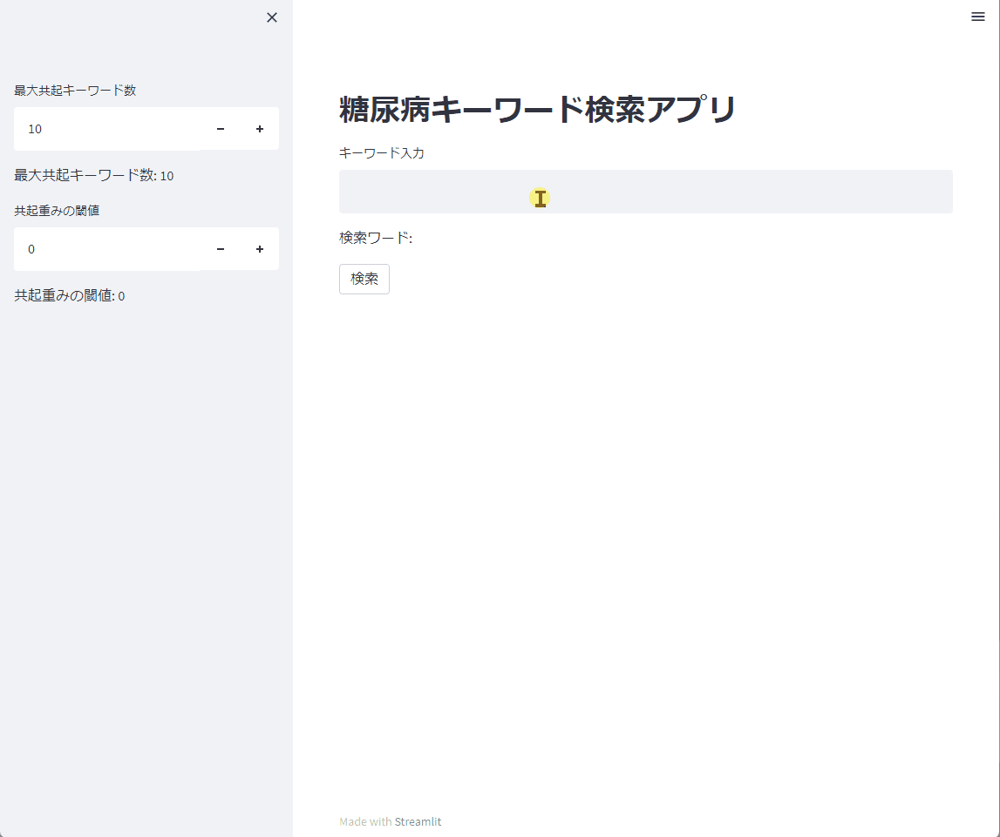

# diabeticCorpus 　ver.0.1
### データセット作成者：徳島大学，松本和幸（研究代表者）

闘病ブログデータの解析のために，[TOBYO](https://www.tobyo.jp/)から「2型糖尿病」に
限定して収集したブログ記事のテキストに対し，
生活習慣に関連するキーワードを人手により抽出し，
カテゴリラベル付けを行ったデータセット（糖尿病闘病ブログコーパス）を構築しました。
一部を公開します。（データ中に個人を特定可能な語句が含まれないかチェック，問題ないデータのみを収録）

キーワードへのカテゴリラベルは以下の種類を定義しています。
データは随時更新します。

### ラベル一覧
- O
- B-食事
- I-食事
- B-効果
- I-効果
- B-入院・治療
- I-入院・治療
- B-運動
- I-運動
- B-睡眠
- I-睡眠
- B-検査
- I-検査
- B-emotion_up
- I-emotion_up
- B-emotion_down
- I-emotion_down
- B-血糖値
- I-血糖値
- B-food
- I-food
- B-HbA1c
- I-HbA1c

本データセットを研究で利用された場合、
論文情報をご連絡いただきましたらここに掲載させていただきます。

## ライセンス
本データセットは研究目的のみの使用に限り利用可能です。
再配布は禁止させていてだきます。

## 連絡先
#### [松本和幸](matumoto@is.tokushima-u.ac.jp) （徳島大学大学院社会産業理工学研究部准教授）

-----------

## 文献情報
##### 宮下翼，松本和幸，吉田稔，西村良太，北研二：　
##### 闘病ブログコーパスからの生活習慣の抽出，
##### 令和3年度 電気・電子・情報関係学会 四国支部連合大会 講演論文集

-----------

## 謝辞
#### 本研究は，2021年度～2022年度　[JKA研究助成（複数年研究）](https://hojo.keirin-autorace.or.jp/)の助成を受けたものです。

